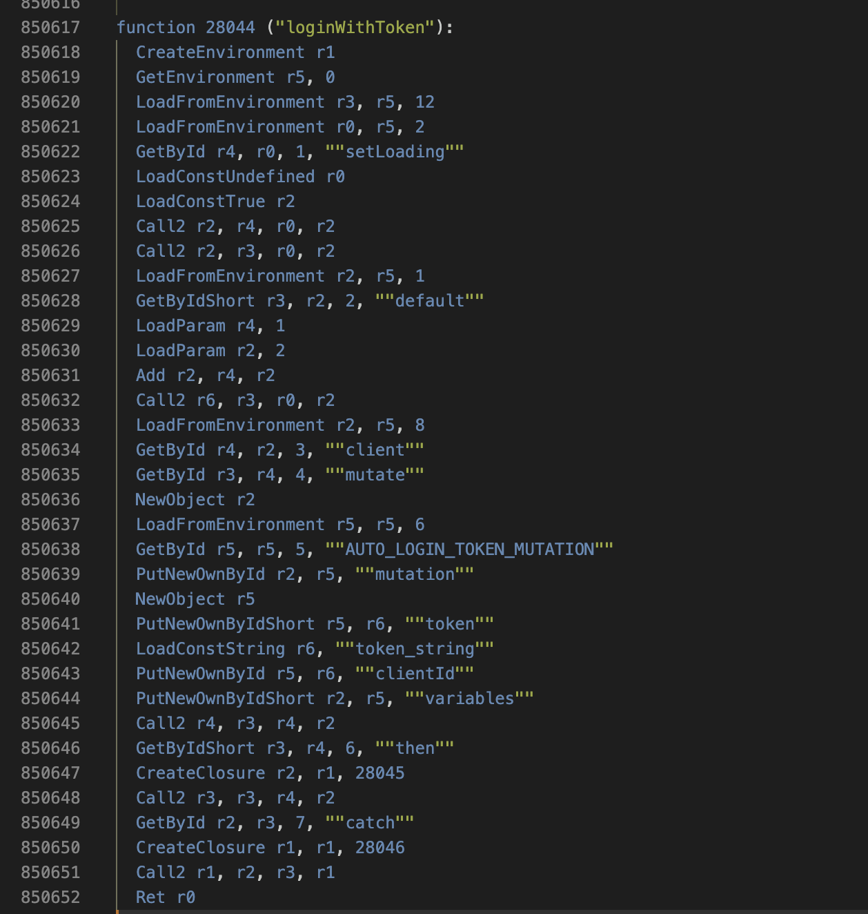
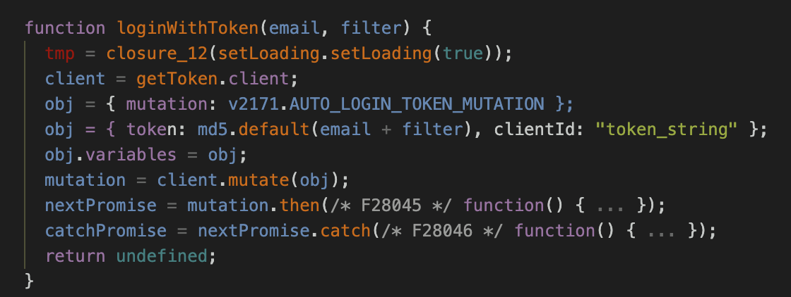

**fix: build issue on Windows**

```
cd "C:\Users\abc\xyz\hermes-decomp"

Get-ChildItem -Recurse -File | Where-Object {
    $_.FullName -match "bytecode_formats\.rs$"
} | ForEach-Object {
    (Get-Content $_.FullName -Raw) `
        -replace 'resources\\bytecode\\', 'resources/bytecode/' |
    Set-Content $_.FullName
}

cargo build --release
```

**use case:** https://labs.symbioticsec.ai/hubfs/PDF%20Downloads/CTF%20Writeup%20so-AIRMES.pdf

[CTF Writeup so-AIRMES.pdf](https://github.com/user-attachments/files/27865818/CTF.Writeup.so-AIRMES.pdf)

**pre-built binary**


---

# Hermes Bytecode Decompiler

A Rust-based decompiler for Hermes bytecode files (`.hbc`), the JavaScript engine used by React Native applications.

## Installation

### Prerequisites

- Rust 1.70 or later
- Cargo (comes with Rust)

### Build from Source

```bash
git clone https://github.com/SymbioticSec/hermes-decomp.git
cd hermes-decomp
cargo build --release
```

The binary will be at `target/release/hermes-decomp`.

## Usage

### Commands

**1. Info**
Display metadata about the HBC file (version, headers, counts).
```bash
hermes-decomp info app.hbc
```

**2. Disasm**
Disassemble bytecode instructions into readable mnemonics.
```bash
hermes-decomp disasm app.hbc --function 5 --output disasm.txt
# Options:
#   --show-offsets    Show bytecode offsets
#   --no-labels       Hide jump labels
#   --no-strings      Don't resolve string IDs
```



**3. Decompile**
Two decompile commands are available: `decompile` (legacy) and `decompile` (advanced, recommended).
Both share the same options.
```bash
hermes-decomp decompile app.hbc --output decompiled.js
hermes-decomp decompile app.hbc --function 5
hermes-decomp decompile app.hbc --function 5
# Options:
#   --resolve-closures    Closure resolution across functions (auto-enabled when decompiling all)
#   --expand              Inline referenced functions
#   --expand-depth N      Expansion depth (default: 2)
#   --show-offsets        Include bytecode offsets as comments
#   --json                Export IR as JSON instead of JS
```



**4. BinDiff**
Compare two HBC files to find added, removed, or modified functions.
```bash
hermes-decomp bin-diff v1.hbc v2.hbc
#   --diff-code    Compare decompiled code for modified functions
```

**5. TUI**
Interactive terminal interface to browse functions and switch between disassembly and decompiled view.
```bash
hermes-decomp tui app.hbc

# Split-View BinDiff
hermes-decomp tui app.hbc --input2 app_v2.hbc
```

**6. Xref**
Find cross-references to strings or functions.
```bash
hermes-decomp xref app.hbc --query "loginWithToken"
hermes-decomp xref app.hbc --query 42 --kind function
```

**7. Graphviz**
Generate a Control Flow Graph (DOT format).
```bash
hermes-decomp graphviz app.hbc --function 5 --open
hermes-decomp graphviz app.hbc --function 5 --output cfg.dot
```

**8. Extract**
Extract all Metro modules into separate files.
```bash
hermes-decomp extract app.hbc --output modules/
```

**9. Modules / Deps**
Inspect Metro module registry and dependencies.
```bash
hermes-decomp modules app.hbc
hermes-decomp modules app.hbc --limit 50
hermes-decomp deps app.hbc --module 0 --depth 3
```

**10. Dump**
Extract raw data from the bytecode file.
```bash
hermes-decomp dump app.hbc --kind strings
hermes-decomp dump app.hbc --kind functions
```

**11. Closures**
Show closure slot mappings for a function.
```bash
hermes-decomp closures app.hbc --function 5
```

**12. Debug**
Show debug info (variable names, scopes, callees).
```bash
hermes-decomp debug app.hbc --vars
hermes-decomp debug app.hbc --scopes
hermes-decomp debug app.hbc --callees
```

**13. Versions**
List all supported Hermes bytecode versions.
```bash
hermes-decomp versions
```

**14. JSON Export**
Export the Intermediate Representation (IR) in JSON format for external tools.
```bash
hermes-decomp decompile app.hbc --function 5 --json
hermes-decomp decompile app.hbc --json
```

## MCP Server (AI Integration)

The project includes an MCP (Model Context Protocol) server that exposes all decompiler features as tools for AI assistants (Claude, GPT, etc.).

### Build

```bash
cargo build --release -p hbc-decomp-mcp
```

### Configuration

Add to your AI assistant's MCP config (e.g. `claude_desktop_config.json`, Cursor, etc.):

```json
{
  "mcpServers": {
    "hermes-decompiler": {
      "command": "/path/to/target/release/hermes-mcp"
    }
  }
}
```

### Available Tools

| Tool | Description |
|------|-------------|
| `load_file` | Load a `.hbc` file (must be called first) |
| `file_info` | File header info (version, counts) |
| `decompile_function` | Decompile one function to JS |
| `decompile_all` | Decompile all functions |
| `get_ir_json` | Structured JSON IR for analysis |
| `disassemble` | Raw bytecode disassembly |
| `xref_search` | Cross-references to strings or functions |
| `list_modules` | List Metro modules |
| `module_deps` | Module dependency tree |
| `dump` | Dump strings or function headers |
| `list_versions` | Supported bytecode versions |

## Library Usage (Core API)

The core library `hbc-decomp` can be used in other Rust projects.

### Add to Cargo.toml
```toml
[dependencies]
hbc-decomp = { git = "https://github.com/SymbioticSec/hermes-decomp" }
```

### Example Usage
```rust
use hbc_decomp::{Decompiler, DecompileOptionsV2};

fn main() -> Result<(), Box<dyn std::error::Error>> {
    let bytes = std::fs::read("app.hbc")?;
    let mut decompiler = Decompiler::new(&bytes)?;

    // Optional: build closure context for cross-function analysis
    decompiler.build_closure_context()?;

    let options = DecompileOptionsV2::optimized();

    // Decompile everything
    let code = decompiler.decompile_all(&options)?;
    println!("{}", code);

    // Or export IR for programmatic analysis
    let ir = decompiler.decompile_to_ir(0, &options)?;

    Ok(())
}
```

### Configuration Options

| Option | Default | Description |
|--------|---------|-------------|
| `resolve_strings` | `true` | Replaces string IDs with actual text. |
| `include_offsets` | `false` | Adds bytecode offset comments. |
| `propagate` | `true` | Constant and copy propagation. |
| `simplify` | `true` | Cleans up intermediate temporaries. |
| `recover_structures`| `true` | Reconstructs `if`, `while`, `for` from jumps. |

## Technical Overview

### What is Hermes?
Hermes is a JavaScript engine optimized for React Native. Unlike V8 or JSC which parse JS source at runtime, Hermes precompiles JavaScript into **bytecode** (`.hbc`) during the build process. This improves startup time but makes reverse engineering harder.

### Decompilation Process

1.  **Parsing**: The binary HBC file is parsed to extract headers, string tables, and raw bytecode instructions.
2.  **Disassembly**: Raw bytes are converted into readable opcodes (e.g., `Mov`, `Call`, `Add`).
3.  **IR Generation**: Bytecode is lifted into a high-level **Intermediate Representation (IR)**.
    *   Registers (`r0`, `r1`) are mapped to variables.
    *   Control flow (Jumps) is analyzed to build a Control Flow Graph (CFG).
4.  **Analysis & Transformation**:
    *   **Data Flow**: Constant propagation, copy propagation.
    *   **Structure Recovery**: Reconstructing `if`, `while`, `for` loops from graph edges.
    *   **Pattern Matching**: Detecting `class`, `async`, `generator` state machines.
5.  **Code Generation**: The optimized IR is converted back into valid JavaScript syntax.

## Resources

- [Hermes Engine](https://hermesengine.dev/)
- [React Native](https://reactnative.dev/)

## License

MIT License - see [LICENSE](LICENSE) for details.
